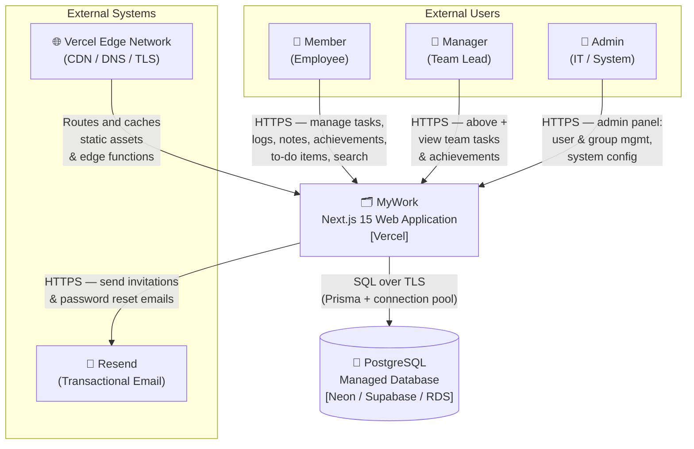
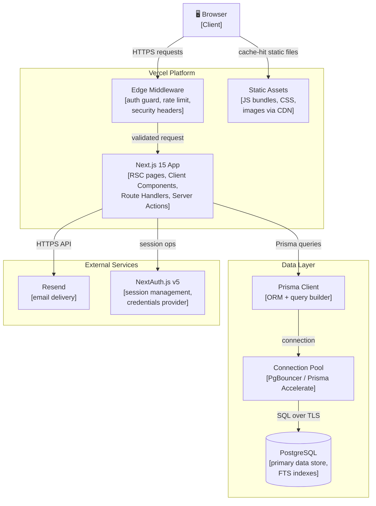
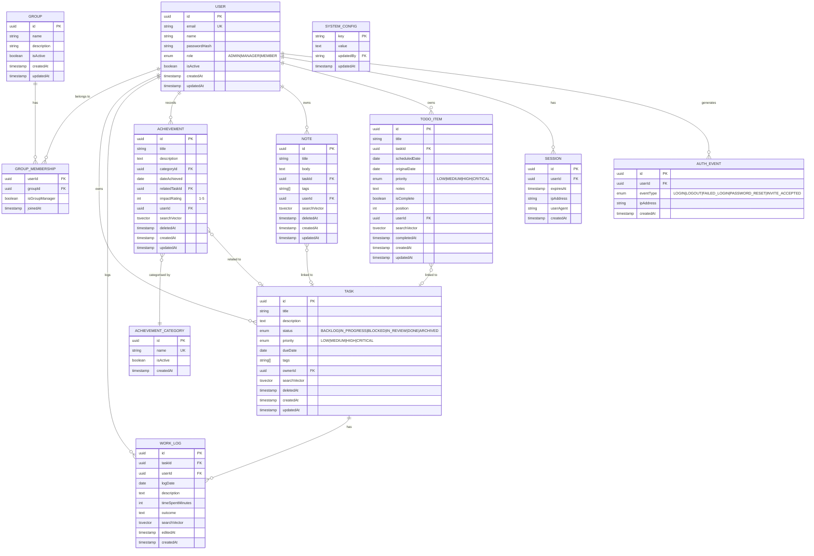
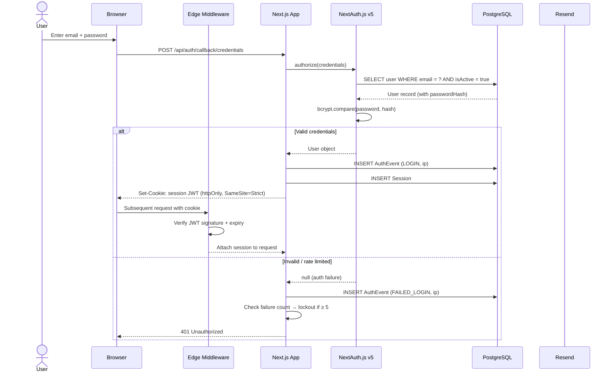
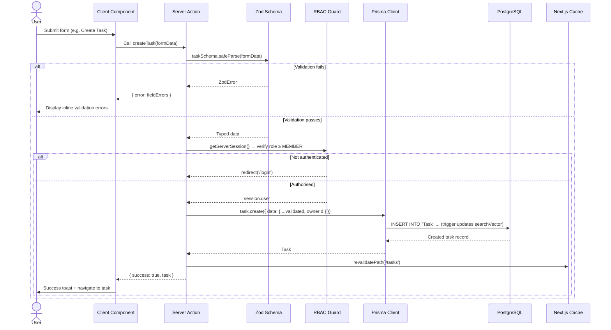
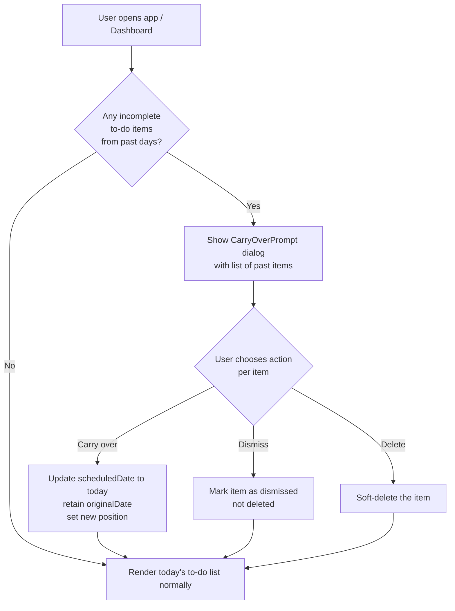
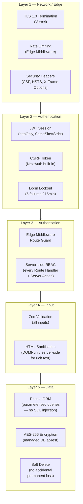
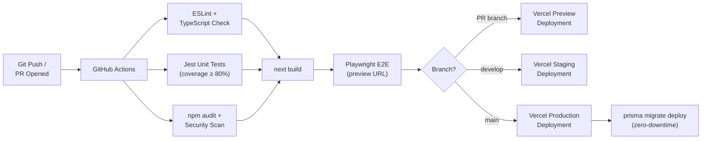

# Solution Architecture Document (SAD)

## Work Management Application — *MyWork*

| Field         | Value                               |
|---------------|-------------------------------------|
| Document ID   | SAD-001                             |
| Version       | 1.0                                 |
| Status        | Draft                               |
| Author        | Architecture Team                   |
| Date          | 2026-02-24                          |
| Related BRD   | BRD-001 v1.0                        |
| Reviewers     | Tech Lead, Security, Platform, QA   |

---

## Table of Contents

1. [Introduction](#1-introduction)
2. [Architecture Principles](#2-architecture-principles)
3. [System Context](#3-system-context)
4. [Container Architecture](#4-container-architecture)
5. [Component Architecture](#5-component-architecture)
6. [Data Architecture](#6-data-architecture)
7. [Data Flow](#7-data-flow)
8. [Technology Stack Decisions](#8-technology-stack-decisions)
9. [API Design](#9-api-design)
10. [Security Architecture](#10-security-architecture)
11. [Scalability Plan](#11-scalability-plan)
12. [Deployment Architecture](#12-deployment-architecture)
13. [Cross-Cutting Concerns](#13-cross-cutting-concerns)
14. [Architecture Decision Records](#14-architecture-decision-records)
15. [Glossary](#15-glossary)

---

## 1. Introduction

### 1.1 Purpose

This document defines the solution architecture for the *MyWork* work management application. It translates the functional and non-functional requirements established in BRD-001 into a concrete technical design, providing engineering teams with the authoritative reference for all architectural decisions.

### 1.2 Scope

This SAD covers:
- System-level context and external dependencies.
- Container and component decomposition (C4 model, Levels 1–3).
- Data model, data flow, and search strategy.
- Technology choices with rationale and trade-offs.
- Security architecture mapped to BRD security requirements.
- Scalability approach and growth path.
- Deployment topology on Vercel and managed PostgreSQL.

### 1.3 Architectural Goals

| Goal                  | BRD Reference     | Architectural Response                                      |
|-----------------------|-------------------|-------------------------------------------------------------|
| Sub-500ms search      | NFR-P2            | PostgreSQL full-text search with tsvector indexes           |
| < 300ms API P95       | NFR-P3            | Server Components reduce round-trips; connection pooling    |
| 99.5% uptime          | NFR-R1            | Vercel edge network + managed PostgreSQL HA                 |
| OWASP Top 10 coverage | NFR-S4            | Zod validation, Prisma parameterised queries, CSP headers   |
| WCAG 2.1 AA           | NFR-U3            | Semantic HTML, Tailwind utilities, server-rendered content  |
| 80% test coverage     | NFR-M1            | Co-located unit tests + Playwright E2E                      |

---

## 2. Architecture Principles

| ID   | Principle                    | Implication                                                                            |
|------|------------------------------|----------------------------------------------------------------------------------------|
| AP-1 | Server-first rendering       | React Server Components (RSC) by default; Client Components only for interactivity.   |
| AP-2 | Zero-trust data access       | Every server function re-validates session and role before touching the database.      |
| AP-3 | Validate at the boundary     | Zod schemas at every API entry point and Server Action; trust nothing from the client. |
| AP-4 | Soft-delete over hard-delete | Tasks, Notes, Achievements use `deletedAt`; data is never physically removed in v1.   |
| AP-5 | Explicit over implicit       | No magic — naming conventions, folder structure, and module boundaries are obvious.    |
| AP-6 | Defer complexity             | v1 uses PostgreSQL FTS instead of a dedicated search engine; migrate when data proves  |
|      |                              | the need.                                                                              |
| AP-7 | Testability by design        | Business logic in pure service functions; UI components receive data as props.         |

---

## 3. System Context

### 3.1 C4 Level 1 — System Context Diagram



### 3.2 External System Responsibilities

| System                 | Provider Options              | Responsibility                                                    |
|------------------------|-------------------------------|-------------------------------------------------------------------|
| Managed PostgreSQL      | Neon, Supabase, AWS RDS       | Primary data store; full-text search; backups; HA failover.       |
| Transactional Email     | Resend                        | User invitation emails; password reset; auth event notifications. |
| Vercel Edge Network     | Vercel (included)             | CDN, TLS termination, DDoS mitigation, preview deployments.       |
| GitHub                  | GitHub                        | Source control, CI/CD trigger via GitHub Actions.                 |

---

## 4. Container Architecture

### 4.1 C4 Level 2 — Container Diagram



### 4.2 Container Responsibilities

| Container           | Technology               | Responsibility                                                                    |
|---------------------|--------------------------|-----------------------------------------------------------------------------------|
| Edge Middleware      | Next.js Middleware (Edge) | Auth session check, route protection, rate limiting, security headers injection.  |
| Next.js App          | Next.js 15 App Router     | All page rendering (RSC + Client), Server Actions, Route Handlers (REST API).     |
| Prisma Client        | Prisma ORM                | Type-safe database access, query building, migration management.                  |
| Connection Pool      | Prisma Accelerate / PgBouncer | Manage database connections; prevent connection exhaustion in serverless.      |
| PostgreSQL           | Managed PostgreSQL 16+    | Relational data store, full-text search via tsvector, referential integrity.      |
| NextAuth.js v5       | NextAuth.js               | Credential verification, JWT session issuance, CSRF protection.                  |
| Resend               | Resend API                | Transactional email delivery (invitations, password resets).                      |

---

## 5. Component Architecture

### 5.1 Next.js App Router Folder Structure

```
app/
├── (auth)/                          # Public auth routes (no session required)
│   ├── login/
│   │   └── page.tsx                 # RSC shell + LoginForm (Client Component)
│   └── forgot-password/
│       └── page.tsx
│
├── (app)/                           # Protected application shell
│   ├── layout.tsx                   # Root protected layout: nav, sidebar, cmd-k search
│   ├── dashboard/
│   │   └── page.tsx                 # Today's summary: pending to-dos, recent tasks
│   ├── tasks/
│   │   ├── page.tsx                 # Task list (RSC — server-filtered)
│   │   ├── [id]/
│   │   │   └── page.tsx             # Task detail: logs, notes, linked to-dos
│   │   └── _components/             # TaskCard, TaskFilters, TaskForm (Client)
│   ├── work-logs/
│   │   ├── page.tsx                 # Consolidated work log list
│   │   └── _components/
│   ├── achievements/
│   │   ├── page.tsx
│   │   └── _components/
│   ├── notes/
│   │   ├── page.tsx
│   │   ├── [id]/
│   │   │   └── page.tsx             # Full note editor (Client Component — rich text)
│   │   └── _components/
│   ├── todos/
│   │   ├── page.tsx                 # Daily to-do view (date param)
│   │   └── _components/             # TodoList, DragHandle, CarryOverPrompt (Client)
│   └── search/
│       └── page.tsx                 # Search results page (RSC with ?q= param)
│
├── (admin)/                         # Admin-only routes
│   ├── layout.tsx                   # Admin layout: role guard + admin nav
│   ├── users/
│   │   └── page.tsx
│   ├── groups/
│   │   └── page.tsx
│   └── settings/
│       └── page.tsx                 # Achievement categories, fiscal year config
│
└── api/                             # Route Handlers (REST API)
    ├── auth/
    │   └── [...nextauth]/
    │       └── route.ts             # NextAuth.js handler
    ├── tasks/
    │   ├── route.ts                 # GET (list), POST (create)
    │   └── [id]/
    │       └── route.ts             # GET, PATCH, DELETE
    ├── work-logs/
    │   ├── route.ts
    │   └── [id]/route.ts
    ├── achievements/
    │   ├── route.ts
    │   ├── [id]/route.ts
    │   └── [id]/export/route.ts     # PDF / Markdown export
    ├── notes/
    │   ├── route.ts
    │   └── [id]/route.ts
    ├── todos/
    │   ├── route.ts
    │   └── [id]/route.ts
    ├── search/
    │   └── route.ts                 # Global search endpoint
    └── admin/
        ├── users/route.ts
        ├── users/[id]/route.ts
        ├── groups/route.ts
        └── groups/[id]/route.ts

middleware.ts                        # Edge auth guard + security headers
```

### 5.2 Component Classification

| Component Type        | Examples                                         | Rendering    |
|-----------------------|--------------------------------------------------|--------------|
| Page (RSC)            | TaskListPage, AchievementsPage, SearchPage       | Server       |
| Layout (RSC)          | AppLayout (nav, sidebar), AdminLayout            | Server       |
| Form (Client)         | TaskForm, WorkLogForm, NoteEditor, LoginForm     | Client       |
| Interactive UI (Client)| TodoList (drag/drop), CarryOverPrompt, CmdK     | Client       |
| Display (RSC)         | TaskCard, WorkLogEntry, AchievementCard          | Server       |
| Route Handler         | /api/tasks, /api/search, /api/auth/[...nextauth] | Server (Edge)|

### 5.3 Server Actions

Server Actions are used for **form mutations** to avoid an explicit API round-trip:

| Action                  | Module        | Description                                      |
|-------------------------|---------------|--------------------------------------------------|
| `createTask`            | Tasks         | Validate with Zod, insert task, revalidate path. |
| `updateTask`            | Tasks         | Partial update, RBAC check, revalidate.          |
| `archiveTask`           | Tasks         | Set status = Archived, soft-delete not applicable.|
| `createWorkLog`         | Work Logs     | Insert entry linked to task.                     |
| `createNote`            | Notes         | Insert note, trigger tsvector update.            |
| `saveDraft`             | Notes         | Upsert draft to DB (called by auto-save timer).  |
| `createTodo`            | To-Do         | Insert item for date, set position.              |
| `completeTodo`          | To-Do         | Set isComplete + completedAt.                    |
| `carryOverTodos`        | To-Do         | Reschedule incomplete past items to today.       |
| `convertTodoToTask`     | To-Do         | Create task from todo, link reference.           |
| `recordAchievement`     | Achievements  | Insert achievement with optional task link.      |
| `inviteUser`            | Admin         | Create user record + send invitation email.      |
| `deactivateUser`        | Admin         | Set isActive=false, revoke all sessions.         |

---

## 6. Data Architecture

### 6.1 Entity Relationship Diagram



### 6.2 Full-Text Search Strategy

**Approach:** PostgreSQL native full-text search using `tsvector` columns.

**Rationale:** At v1 scale (≤10,000 records per user), PostgreSQL FTS satisfies the 500ms SLA without adding operational complexity of a dedicated search engine. This can be migrated to Meilisearch or Typesense in v2 if needed.

**Implementation:**

Each searchable entity has a `searchVector tsvector` column maintained by a PostgreSQL trigger:

```sql
-- Example: Task search vector trigger
CREATE FUNCTION task_search_vector_update() RETURNS trigger AS $$
BEGIN
  NEW."searchVector" :=
    setweight(to_tsvector('english', coalesce(NEW.title, '')), 'A') ||
    setweight(to_tsvector('english', coalesce(NEW.description, '')), 'B') ||
    setweight(to_tsvector('english', coalesce(array_to_string(NEW.tags, ' '), '')), 'B');
  RETURN NEW;
END;
$$ LANGUAGE plpgsql;

CREATE TRIGGER task_search_update
  BEFORE INSERT OR UPDATE ON "Task"
  FOR EACH ROW EXECUTE FUNCTION task_search_vector_update();

CREATE INDEX task_search_idx ON "Task" USING GIN ("searchVector");
```

**Weight scheme per entity:**

| Entity      | Weight A (highest)   | Weight B              | Weight C                |
|-------------|----------------------|-----------------------|-------------------------|
| Task        | title                | description, tags     | —                       |
| Work Log    | —                    | description           | outcome                 |
| Achievement | title                | description, category | —                       |
| Note        | title                | body (first 500 chars)| —                       |
| To-Do       | title                | notes                 | —                       |

**Search query execution:**

```sql
-- Global search across all entities for a user
SELECT 'task' as module, id, title as label,
       ts_headline('english', description, q) as snippet,
       ts_rank("searchVector", q) as rank
FROM "Task", to_tsquery('english', :query) q
WHERE "ownerId" = :userId
  AND "deletedAt" IS NULL
  AND "searchVector" @@ q

UNION ALL

SELECT 'note' as module, id, title as label,
       ts_headline('english', body, q) as snippet,
       ts_rank("searchVector", q) as rank
FROM "Note", to_tsquery('english', :query) q
WHERE "userId" = :userId
  AND "deletedAt" IS NULL
  AND "searchVector" @@ q

-- ... additional UNION ALL blocks per module

ORDER BY rank DESC
LIMIT 50;
```

### 6.3 Soft Delete Pattern

Entities with soft delete (`deletedAt` timestamp):

| Entity       | Hard delete supported? | Notes                                     |
|--------------|------------------------|-------------------------------------------|
| Task         | Yes (Admin only)       | Hard delete cascades work logs + note links. |
| Note         | No                     | Only soft delete; Admin can purge.        |
| Achievement  | No                     | Retained for audit; Admin can purge.      |

Queries always append `WHERE "deletedAt" IS NULL` via a Prisma middleware extension:

```typescript
// lib/prisma.ts — global soft-delete middleware
prisma.$use(async (params, next) => {
  if (['Task', 'Note', 'Achievement'].includes(params.model ?? '')) {
    if (params.action === 'findMany' || params.action === 'findFirst') {
      params.args.where = { ...params.args.where, deletedAt: null };
    }
  }
  return next(params);
});
```

### 6.4 Key Database Indexes

```sql
-- Performance indexes
CREATE INDEX idx_task_owner_status    ON "Task"("ownerId", "status") WHERE "deletedAt" IS NULL;
CREATE INDEX idx_task_owner_due       ON "Task"("ownerId", "dueDate") WHERE "deletedAt" IS NULL;
CREATE INDEX idx_worklog_task         ON "WorkLog"("taskId", "logDate" DESC);
CREATE INDEX idx_worklog_user_date    ON "WorkLog"("userId", "logDate" DESC);
CREATE INDEX idx_achievement_user     ON "Achievement"("userId", "dateAchieved" DESC) WHERE "deletedAt" IS NULL;
CREATE INDEX idx_note_user            ON "Note"("userId", "updatedAt" DESC) WHERE "deletedAt" IS NULL;
CREATE INDEX idx_todo_user_date       ON "TodoItem"("userId", "scheduledDate", "position");
CREATE INDEX idx_todo_incomplete      ON "TodoItem"("userId", "scheduledDate") WHERE "isComplete" = false;

-- Full-text search (GIN)
CREATE INDEX idx_task_fts         ON "Task" USING GIN("searchVector");
CREATE INDEX idx_worklog_fts      ON "WorkLog" USING GIN("searchVector");
CREATE INDEX idx_achievement_fts  ON "Achievement" USING GIN("searchVector");
CREATE INDEX idx_note_fts         ON "Note" USING GIN("searchVector");
CREATE INDEX idx_todo_fts         ON "TodoItem" USING GIN("searchVector");
```

---

## 7. Data Flow

### 7.1 Authentication Flow



### 7.2 Core Data Mutation Flow (Server Action)



### 7.3 Global Search Flow

```mermaid
sequenceDiagram
    actor User
    participant CmdK as CmdK Dialog (Client)
    participant Debounce as Debounce (300ms)
    participant RouteHandler as GET /api/search
    participant RBAC as Session + RBAC
    participant DB as PostgreSQL FTS
    participant Cache as Next.js unstable_cache

    User->>CmdK: Type search query
    CmdK->>Debounce: Debounce keystrokes (300ms)
    Debounce->>RouteHandler: GET /api/search?q=<term>&modules=tasks,notes
    RouteHandler->>RBAC: Verify session; extract userId + role
    RouteHandler->>Cache: Check cache key (userId + query + modules)

    alt Cache hit (TTL 30s)
        Cache-->>RouteHandler: Cached results
    else Cache miss
        RouteHandler->>DB: UNION ALL FTS query scoped to userId
        DB->>DB: GIN index scan per module table
        DB-->>RouteHandler: Ranked results with snippets
        RouteHandler->>Cache: Store result (TTL 30s)
    end

    RouteHandler-->>CmdK: JSON { results: [{module, id, label, snippet}] }
    CmdK->>User: Render grouped results with highlighted matches
    User->>CmdK: Click result
    CmdK->>User: Navigate to entity detail page
```

### 7.4 To-Do Carry-Over Flow



---

## 8. Technology Stack Decisions

### 8.1 Stack Overview

| Layer               | Technology            | Version  |
|---------------------|-----------------------|----------|
| Framework           | Next.js App Router    | 15.x     |
| Language            | TypeScript (strict)   | 5.x      |
| Styling             | Tailwind CSS          | 4.x      |
| ORM                 | Prisma                | 6.x      |
| Database            | PostgreSQL            | 16+      |
| Auth                | NextAuth.js           | v5 (beta)|
| Validation          | Zod                   | 3.x      |
| Rich Text Editor    | Tiptap                | 2.x      |
| Drag & Drop         | @dnd-kit/core         | 6.x      |
| PDF Export          | @react-pdf/renderer   | 3.x      |
| Email               | Resend + react-email  | latest   |
| Testing (Unit)      | Jest + RTL            | 29.x     |
| Testing (E2E)       | Playwright            | 1.x      |
| CI/CD               | GitHub Actions        | —        |
| Hosting             | Vercel                | —        |
| DB Connection Pool  | Prisma Accelerate     | —        |

### 8.2 Decision Rationale

#### DR-01 — Next.js 15 App Router (Server Components by default)

**Decision:** Use React Server Components as the default rendering mode; Client Components only where interactivity is required.

**Rationale:**
- Eliminates unnecessary client-side data fetching waterfalls; data is fetched server-side and streamed.
- Reduces JavaScript bundle size sent to the browser (display-only components ship zero JS).
- Native support for Server Actions removes need for a separate tRPC/REST mutation layer for forms.
- Aligns with the BRD constraint (C-1) mandating Next.js 15.

**Trade-off:** Learning curve for teams unfamiliar with RSC boundary decisions. Mitigated by `use client` linting rules and PR review checklist.

---

#### DR-02 — PostgreSQL Full-Text Search (over dedicated search engine)

**Decision:** Implement global search using PostgreSQL native FTS (`tsvector` + GIN indexes) rather than Meilisearch, Typesense, or Elasticsearch.

**Rationale:**
- BRD NFR-P2 requires 500ms for ≤10,000 records. PostgreSQL FTS with GIN indexes consistently achieves <50ms at this scale.
- Eliminates an additional managed service, its cost, and its operational complexity in v1.
- Data consistency is automatic — no synchronisation lag between DB and a search index.
- Migration path to a dedicated engine is well-defined if scale grows.

**Trade-off:** Lacks advanced search features (typo tolerance, faceting, synonyms). Acceptable for v1; revisit at v2 if user feedback identifies gaps.

---

#### DR-03 — NextAuth.js v5 (Credentials Provider)

**Decision:** Use NextAuth.js v5 with `CredentialsProvider` for email + password authentication.

**Rationale:**
- BRD assumption A-3 defers SSO to v2. NextAuth v5 supports CredentialsProvider cleanly and provides a straightforward migration to OAuth providers later.
- v5 natively supports the App Router with edge-compatible session handling.
- Built-in CSRF protection, session management, and the `auth()` helper integrate directly with Server Components.

**Trade-off:** v5 is in release-candidate phase. Pin to a specific minor version; monitor release notes. Risk mitigated by abstraction behind an `auth/` module.

---

#### DR-04 — Prisma ORM + Prisma Accelerate

**Decision:** Use Prisma as the ORM with Prisma Accelerate for connection pooling.

**Rationale:**
- Type-safe query builder eliminates SQL injection risk (NFR-S4).
- Schema-as-code with versioned migrations satisfies NFR-M3.
- Vercel deploys Next.js as serverless functions — each invocation creates a new process. Without pooling, the database will exhaust connection limits. Prisma Accelerate (or PgBouncer) acts as a persistent connection pool.

**Trade-off:** Prisma Accelerate adds a small latency overhead (~5–15ms) and a cost per request at high volume. Alternative: self-hosted PgBouncer on the database host.

---

#### DR-05 — Tiptap for Rich Text Editor

**Decision:** Use Tiptap (ProseMirror-based) for the Notes rich text editor.

**Rationale:**
- Headless architecture integrates cleanly with Tailwind CSS styling.
- Supports required formats (bold, italic, code, lists, hyperlinks — BRD AC-N-01-5).
- Output stored as JSON (Tiptap document model) in the DB; rendered as HTML on display.
- Active community and MIT-licensed core extensions.

**Trade-off:** JSON body requires serialisation for full-text search. The tsvector trigger extracts plaintext from JSON body via `jsonb_to_tsvector` or a custom function.

---

#### DR-06 — Zod for Input Validation

**Decision:** Every API Route Handler and Server Action validates input through a Zod schema before any business logic executes.

**Rationale:**
- Provides runtime type safety at system boundaries (AP-3, NFR-S3).
- Type inference from Zod schemas flows through to TypeScript types, eliminating duplication.
- Structured error objects map directly to form field errors in the UI.

---

### 8.3 Rejected Alternatives

| Consideration            | Rejected Option      | Reason Rejected                                                          |
|--------------------------|----------------------|--------------------------------------------------------------------------|
| Search engine            | Meilisearch          | Unnecessary operational overhead at v1 scale; PostgreSQL FTS sufficient. |
| ORM                      | Drizzle ORM          | Less mature migration tooling; team more familiar with Prisma.           |
| Auth                     | Lucia Auth           | Less ecosystem support; NextAuth v5 better aligned with App Router.      |
| Rich text editor         | Lexical (Meta)       | Larger bundle; Tiptap has better extension ecosystem for requirements.   |
| State management         | Zustand / Redux      | Server Components reduce the need for global client state; React state + URL sufficient. |
| Email                    | Nodemailer (SMTP)    | Requires infrastructure management; Resend is serverless-native.         |

---

## 9. API Design

### 9.1 Route Handler Conventions

All Route Handlers follow RESTful conventions:

| Method   | Route                       | Action                              | Auth Required  |
|----------|-----------------------------|-------------------------------------|----------------|
| `GET`    | `/api/tasks`                | List tasks (filtered)               | Member+        |
| `POST`   | `/api/tasks`                | Create task                         | Member+        |
| `GET`    | `/api/tasks/:id`            | Get task detail                     | Owner/Admin    |
| `PATCH`  | `/api/tasks/:id`            | Update task fields                  | Owner/Admin    |
| `DELETE` | `/api/tasks/:id`            | Hard delete task                    | Admin only     |
| `GET`    | `/api/work-logs`            | List work logs (filtered)           | Member+        |
| `POST`   | `/api/work-logs`            | Create work log                     | Member+        |
| `PATCH`  | `/api/work-logs/:id`        | Edit work log                       | Author/Admin   |
| `DELETE` | `/api/work-logs/:id`        | Delete work log                     | Author/Admin   |
| `GET`    | `/api/achievements`         | List achievements                   | Member+        |
| `POST`   | `/api/achievements`         | Record achievement                  | Member+        |
| `GET`    | `/api/achievements/:id/export` | Export PDF / Markdown            | Owner/Admin    |
| `GET`    | `/api/notes`                | List notes                          | Member+        |
| `POST`   | `/api/notes`                | Create note                         | Member+        |
| `PATCH`  | `/api/notes/:id`            | Update note                         | Owner/Admin    |
| `GET`    | `/api/todos`                | List to-dos (by date)               | Member+        |
| `POST`   | `/api/todos`                | Create to-do item                   | Member+        |
| `PATCH`  | `/api/todos/:id`            | Update / complete to-do             | Owner/Admin    |
| `GET`    | `/api/search`               | Global full-text search             | Member+        |
| `GET`    | `/api/admin/users`          | List users                          | Admin only     |
| `POST`   | `/api/admin/users`          | Invite user                         | Admin only     |
| `PATCH`  | `/api/admin/users/:id`      | Edit / deactivate user              | Admin only     |
| `GET`    | `/api/admin/groups`         | List groups                         | Admin only     |
| `POST`   | `/api/admin/groups`         | Create group                        | Admin only     |
| `PATCH`  | `/api/admin/groups/:id`     | Edit group / members                | Admin only     |

### 9.2 Standard Response Envelope

```typescript
// Success
{ "data": <T>, "meta"?: { "total": number, "page": number } }

// Error
{ "error": { "code": string, "message": string, "fields"?: Record<string, string[]> } }
```

### 9.3 Pagination

All list endpoints support cursor-based pagination:
- `?cursor=<lastId>&limit=25` (default limit: 25, max: 100)
- Response includes `"meta": { "nextCursor": string | null, "total": number }`

---

## 10. Security Architecture

### 10.1 Security Layers



### 10.2 Authentication & Session

| Concern                | Implementation                                                                    |
|------------------------|-----------------------------------------------------------------------------------|
| Password storage       | bcrypt with cost factor 12 (≈250ms hash time — brute-force resistant).           |
| Session token          | NextAuth JWT in `__Secure-next-auth.session-token` (httpOnly, Secure, SameSite=Strict). |
| Session expiry         | 8 hours of inactivity (BRD AC-UG-04-3); `maxAge` set on JWT.                    |
| CSRF protection        | NextAuth's built-in `csrfToken` + SameSite=Strict cookie prevents CSRF.          |
| Password reset link    | 1-hour expiry token (SHA-256 random); invalidated on first use.                  |
| Account lockout        | 5 consecutive failures → 15-minute lockout stored in DB (`AuthEvent` count query). |

### 10.3 Role-Based Access Control Implementation

RBAC is enforced in **two places** — never only in the UI:

```typescript
// lib/auth/rbac.ts
export async function requireRole(
  minRole: Role,
  resourceOwnerId?: string
): Promise<Session['user']> {
  const session = await auth(); // NextAuth v5 auth()
  if (!session?.user) redirect('/login');

  const roleRank: Record<Role, number> = { MEMBER: 0, MANAGER: 1, ADMIN: 2 };

  if (roleRank[session.user.role] < roleRank[minRole]) {
    throw new ForbiddenError('Insufficient role');
  }

  // Ownership check: MEMBER can only access their own resources
  if (session.user.role === 'MEMBER' && resourceOwnerId) {
    if (session.user.id !== resourceOwnerId) {
      throw new ForbiddenError('Resource not owned by user');
    }
  }

  return session.user;
}
```

### 10.4 Security Headers (next.config.ts)

```typescript
const securityHeaders = [
  { key: 'X-DNS-Prefetch-Control',       value: 'on' },
  { key: 'Strict-Transport-Security',    value: 'max-age=63072000; includeSubDomains; preload' },
  { key: 'X-Frame-Options',              value: 'SAMEORIGIN' },
  { key: 'X-Content-Type-Options',       value: 'nosniff' },
  { key: 'Referrer-Policy',              value: 'strict-origin-when-cross-origin' },
  { key: 'Permissions-Policy',           value: 'camera=(), microphone=(), geolocation=()' },
  {
    key: 'Content-Security-Policy',
    value: [
      "default-src 'self'",
      "script-src 'self' 'unsafe-inline'",   // Next.js requires unsafe-inline for hydration
      "style-src 'self' 'unsafe-inline'",
      "img-src 'self' data: blob:",
      "font-src 'self'",
      "connect-src 'self' https://api.resend.com",
      "frame-ancestors 'none'",
    ].join('; '),
  },
];
```

### 10.5 Input Validation & XSS Prevention

- **All API inputs** are parsed through a Zod schema; raw values are never passed to Prisma.
- **Rich text (Notes)**: Tiptap content stored as JSON, not raw HTML. When rendered, converted to HTML server-side and sanitised with `isomorphic-dompurify` before emission.
- **Tags and free-text fields**: Max-length enforced at Zod + DB column level.

### 10.6 GDPR Compliance

| Requirement                  | Implementation                                                                  |
|------------------------------|---------------------------------------------------------------------------------|
| Data subject access          | Admin "Export user data" action generates a ZIP of all user records.           |
| Right to erasure             | Admin "Purge user" hard-deletes all records after soft-delete; email anonymised.|
| Data minimisation            | Only fields necessary for function are collected.                               |
| Data at rest encryption      | Managed DB provider encrypts at rest (AES-256) — verify with chosen provider.  |
| Data in transit              | TLS 1.3+ enforced by Vercel edge; no HTTP downgrade.                            |
| Audit logging                | `AuthEvent` table logs all authentication events with timestamp and IP.         |

---

## 11. Scalability Plan

### 11.1 v1.0 Capacity Envelope

| Resource                | v1 Configuration                    | Supports (estimated)       |
|-------------------------|-------------------------------------|----------------------------|
| Vercel Functions         | Serverless (auto-scale)             | Unlimited concurrent requests (Vercel manages) |
| PostgreSQL               | 2 vCPU / 4GB RAM managed instance  | ~500 concurrent connections (via pool) |
| Prisma Accelerate Pool   | 1,000 connection pool slots         | 500 concurrent app users   |
| Database storage         | 50GB initial allocation             | ~2 million records per entity |

This directly satisfies BRD NFR-P4 (500 concurrent users).

### 11.2 Scaling Triggers and Migration Path

```mermaid
graph LR
    subgraph V1["v1.0 — Launch"]
        V1A["PostgreSQL FTS\nGIN indexes"]
        V1B["Prisma Accelerate\nconnection pool"]
        V1C["Vercel Serverless\nauto-scale"]
    end

    subgraph V2["v2.0 — Scale (>5k users)"]
        V2A["Meilisearch / Typesense\ndedicated search"]
        V2B["Read replica\nfor search + analytics"]
        V2C["Vercel Edge Functions\nfor latency-critical paths"]
    end

    subgraph V3["v3.0 — Enterprise (>50k users)"]
        V3A["Multi-tenant\ndatabase sharding"]
        V3B["Redis cache\nfor session + hot data"]
        V3C["CDN-cached\nSSG for public pages"]
    end

    V1 -->|"Search P95 > 500ms\nor > 5k active users"| V2
    V2 -->|"Multi-org / > 50k users"| V3
```



### 11.3 Caching Strategy

| Cache Layer           | Technology                  | What is cached                                         | TTL       |
|-----------------------|-----------------------------|--------------------------------------------------------|-----------|
| Search results        | `next/cache` unstable_cache | Search query results per user + query string           | 30 seconds|
| Static assets         | Vercel CDN                  | JS bundles, CSS, images                                | Immutable |
| RSC page data         | Next.js full-route cache    | Public/semi-static pages (revalidated on mutation)     | On-demand |
| DB query results      | Prisma Accelerate cache     | Frequently repeated read queries (e.g. user profile)  | 60 seconds|

### 11.4 Database Connection Management

Vercel deploys each function invocation as a new process. Without pooling, each invocation opens a direct PostgreSQL connection, exhausting the server's limit rapidly.

**Solution:** Prisma Accelerate (or PgBouncer in transaction mode):

```
Browser → Vercel Function → Prisma Accelerate (pooler) → PostgreSQL
                              [persistent pool: 1,000 slots]
```

This maintains a warm pool of connections; each function invocation borrows a slot and returns it immediately after the query completes.

---

## 12. Deployment Architecture

### 12.1 Environments

| Environment | Branch          | URL                           | Purpose                                  |
|-------------|-----------------|-------------------------------|------------------------------------------|
| Production  | `main`          | `https://mywork.example.com`  | Live system; protected; requires PR.     |
| Staging     | `develop`       | `https://staging.mywork.app`  | Pre-prod; mirrors production config.     |
| Preview     | Any PR branch   | `https://<hash>.vercel.app`   | Per-PR preview deployments (Vercel auto).|
| Local       | feature branch  | `http://localhost:3000`       | Developer machines.                      |

### 12.2 CI/CD Pipeline



### 12.3 Environment Variables

| Variable                        | Environment       | Description                                         |
|---------------------------------|-------------------|-----------------------------------------------------|
| `DATABASE_URL`                  | All               | PostgreSQL connection string (via Accelerate proxy). |
| `NEXTAUTH_SECRET`               | All               | 32-byte random secret for JWT signing.              |
| `NEXTAUTH_URL`                  | Staging + Prod    | Canonical URL for NextAuth redirects.               |
| `RESEND_API_KEY`                | All               | Resend transactional email API key.                 |
| `EMAIL_FROM`                    | All               | Sender address for system emails.                   |
| `PRISMA_ACCELERATE_URL`         | Staging + Prod    | Prisma Accelerate connection pool endpoint.         |

All secrets are stored in Vercel Environment Variables, never committed to source.

### 12.4 Database Migration Strategy

- Migrations are managed by Prisma (`prisma migrate dev` locally, `prisma migrate deploy` in CI).
- **Zero-downtime migrations:** Additive changes only (new columns nullable or with defaults, new tables). Destructive changes (column removal) done in two-phase releases:
  1. Phase 1: Deploy code that ignores the old column; migrate to add new column.
  2. Phase 2: After stable deployment, migrate to drop old column.
- Migration scripts are reviewed in PR by Tech Lead before merge to `develop`.

---

## 13. Cross-Cutting Concerns

### 13.1 Logging & Observability

| Concern          | Tool / Approach                                                                        |
|------------------|----------------------------------------------------------------------------------------|
| Application logs | Structured JSON logs via `pino` logger; never `console.log` in production.             |
| Log levels       | `error`, `warn`, `info`, `debug` — controlled by `LOG_LEVEL` env var.                 |
| Access logs      | Vercel access logs via Vercel Dashboard / Vercel Log Drains.                           |
| Error tracking   | Sentry (Next.js SDK) for uncaught errors + API errors with user context.               |
| Performance      | Vercel Analytics + Web Vitals for LCP, FID, CLS monitoring.                           |
| Auth events      | All auth events written to `AuthEvent` table (searchable by Admin).                    |

### 13.2 Error Handling

- **Server Components:** Errors bubble to the nearest `error.tsx` boundary.
- **Server Actions:** Return typed `{ error: ... }` objects; never throw across the network.
- **Route Handlers:** Wrap in try/catch; return standardised error envelope (§9.2).
- **Client Components:** Wrap with React `ErrorBoundary` for graceful degradation.

### 13.3 Accessibility

- All interactive elements are keyboard navigable.
- Focus management handled on modal open/close and route transitions.
- ARIA labels on icon-only buttons and form controls.
- Colour contrast ratios meet WCAG 2.1 AA (4.5:1 for normal text, 3:1 for large text).
- Automated accessibility checks via `axe-core` in Playwright E2E tests.

### 13.4 Testing Strategy

| Test Type      | Tool                     | Location            | Coverage Target          |
|----------------|--------------------------|---------------------|--------------------------|
| Unit           | Jest + RTL               | `*.test.ts` co-located | ≥ 80% on service layer |
| Integration    | Jest + Prisma test DB    | `__tests__/`        | All repository functions |
| E2E            | Playwright               | `/e2e/`             | Critical user journeys   |
| Accessibility  | axe-core (Playwright)    | `/e2e/a11y/`        | All page templates       |
| Security       | npm audit + Snyk CI      | CI pipeline         | 0 high/critical CVEs     |

### 13.5 Configuration Management

Runtime configuration (fiscal year, achievement categories) is stored in the `SystemConfig` table, managed through the Admin settings panel. This avoids code deployments for routine configuration changes.

---

## 14. Architecture Decision Records

### ADR-001 — PostgreSQL as search engine for v1

- **Status:** Accepted
- **Context:** BRD requires sub-500ms search across ≤10,000 records per user. Dedicated search engines (Meilisearch, Typesense) add operational cost and complexity.
- **Decision:** Use PostgreSQL `tsvector` + GIN indexes for full-text search in v1.
- **Consequences:** No typo tolerance or faceted search. Acceptable for v1. Revisit when P95 search latency exceeds 400ms in production metrics.

### ADR-002 — Server Actions over a standalone API for mutations

- **Status:** Accepted
- **Context:** Next.js 15 Server Actions provide type-safe form mutations without a separate client-side fetch layer.
- **Decision:** Use Server Actions for all CRUD mutations; Route Handlers for programmatic API access (mobile, integrations in v2).
- **Consequences:** Server Actions are tightly coupled to the Next.js deployment. For v2 mobile clients, Route Handlers already exist as a parallel path.

### ADR-003 — Soft delete for Tasks, Notes, Achievements

- **Status:** Accepted
- **Context:** BRD NFR-D2 requires soft delete to prevent accidental data loss.
- **Decision:** `deletedAt` timestamp column; Prisma middleware filters these globally.
- **Consequences:** Archived data accumulates; a periodic Admin purge job will be needed in v2. The Prisma middleware must be maintained carefully — test that it does not filter Admin bulk-export queries.

### ADR-004 — Prisma Accelerate for connection pooling

- **Status:** Accepted
- **Context:** Vercel serverless functions create a new process per request. Direct PostgreSQL connections would exhaust the database's connection limit at scale.
- **Decision:** Route all database connections through Prisma Accelerate pooler.
- **Consequences:** Adds ~5–15ms latency per query. Adds a per-request cost at high volume. Alternative fallback: self-hosted PgBouncer on the database instance.

### ADR-005 — Tiptap for rich text notes

- **Status:** Accepted
- **Context:** Notes require basic rich text (BRD AC-N-01-5). The editor must integrate with Tailwind CSS and support auto-save.
- **Decision:** Tiptap (headless ProseMirror wrapper) with custom Tailwind-styled toolbar.
- **Consequences:** Tiptap's JSON output requires a custom `jsonb → plaintext` extraction function for PostgreSQL FTS vector generation. This must be implemented and tested as part of the Note entity search feature.

---

## 15. Glossary

| Term                  | Definition                                                                                                |
|-----------------------|-----------------------------------------------------------------------------------------------------------|
| RSC                   | React Server Component — a component that renders exclusively on the server with no client-side JS.       |
| Server Action         | A Next.js 15 feature allowing server-side functions to be called directly from Client Components.         |
| Route Handler         | Next.js App Router's equivalent of an API route — a `route.ts` file exporting HTTP method handlers.      |
| tsvector              | A PostgreSQL data type representing a sorted list of lexemes used for full-text search.                   |
| GIN Index             | Generalised Inverted Index — a PostgreSQL index type optimised for `tsvector` full-text search.           |
| Soft Delete           | Marking a record as deleted via a `deletedAt` timestamp instead of physically removing it from the DB.    |
| Connection Pool       | A cache of database connections maintained so each request borrows rather than opens a new connection.    |
| Prisma Accelerate     | Prisma's managed connection pool and query cache service, designed for serverless environments.            |
| RBAC                  | Role-Based Access Control — restricting actions based on a user's assigned role.                          |
| CSP                   | Content Security Policy — an HTTP header that controls which resources a browser may load.                |
| HSTS                  | HTTP Strict Transport Security — forces browsers to use HTTPS for all future requests to a domain.        |
| CSRF                  | Cross-Site Request Forgery — an attack that tricks a user into submitting unintended requests.            |
| JWT                   | JSON Web Token — a compact, signed token used to represent a session claim.                               |
| LCP                   | Largest Contentful Paint — a Core Web Vital measuring perceived page load speed.                          |
| RTO / RPO             | Recovery Time Objective / Recovery Point Objective — disaster recovery targets defined in BRD NFR-R3.     |
| PgBouncer             | A lightweight PostgreSQL connection pooler, an alternative to Prisma Accelerate for connection management. |

---

*End of Document — SAD-001 v1.0*
